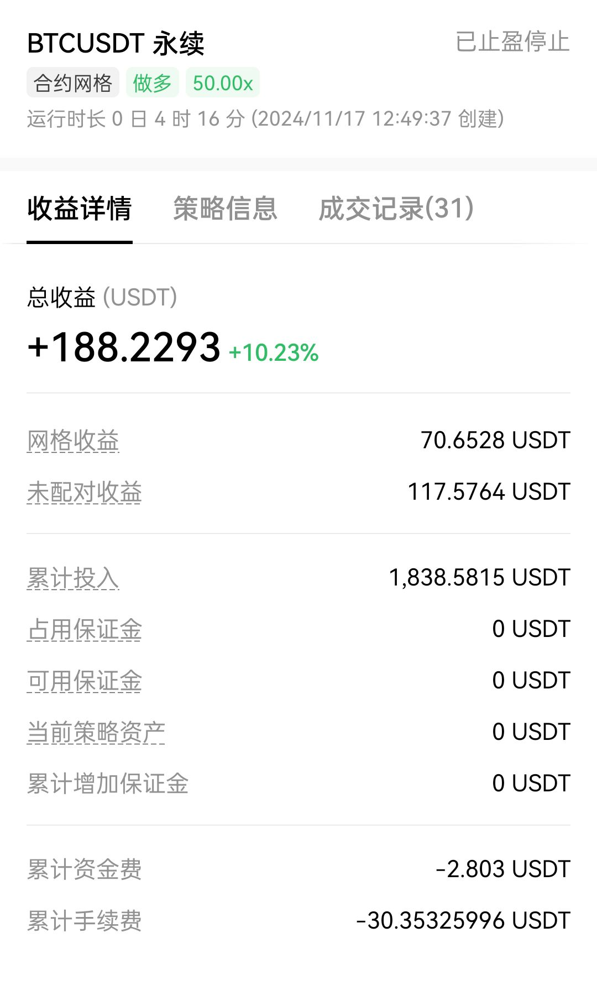

# 11月
## 概况

## Day1 (2024.11.17)

### 开盘本金：1830 u

今天btc开盘90600左右，上午盲目入了1000u（90650），之后短时间内跌倒90300左右，心慌觉得接下来要接着跌于是想开盘做空，找了个10倍合约然后投了800u，中间掉到90100，然后十点又涨回90600，于是把做空合约取消，亏个位数，然后没操作观望中。

戏剧效果再早上10：30左右一路跌倒89400，觉得接下来可能会涨，准备开做多x50，但是实际在11：50的时间，90300的时候开始做多，中间操作失误亏了一次手续，做多到90900的时候已经有12%的收益（110u左右），截图装了个b，但没舍得卖出，随后价格开始回调拉扯，一点到了90600，我加仓了1100u（之前买的在价格90850的时候自动挂单卖掉了），加仓完俯冲90400，现在下午2点，在90500左右。

我今天摄入的信息都比较正面（我的信息来源主要是加密货币相关资讯网站和youtube政治经济频道，没有去telegram或者交流群，我认为与其相信陌生群友的信息不如自己分析），我认为今天大盘应该是涨而不是跌，就算跌也不应该跌倒85737（我的爆仓线），今天的底我现在预测大概是早上10点的89700，（现在2点17分），顶我不知道时间但相信应该能有91300以上，如果今天睡前达到了这个值，除非肉眼可见连续连续，否则我将直接卖出。预计收益在10%以上。如果没有到达91300那就等到明天。

17.05，波动至91500，我在91350出售，直接闭眼，今天到此为止。

理智分析了一下，不确定是否会大幅回调，假设回落的话，~~如果回落到89500以下我会50x梭哈现货~~，如果仍保持90000以上我大概率保持观望，因为明天周一且这几天的底一般都在12点（东八区时间）。

21:41 90633

对于这个回调，我的想法是，由于快12点了，我觉得风险操作对睡眠不好，打算找个底开一个现货做多，我也不知道底会是多少，但掉回88000以下的概率很小，打算开个自动检测，89100或者89500买入（16、17日的底），由于是现货交易所以大胆点检查到89500时买入，等第二天再卖出（我打算早上卖出不然没有资金去操作）。

22：01 90620

2000u全部挂了个自动炒波段策略，算了算要是不出啥问题明天收益大概10~20u

17号最后一更
23：00 90300
波段不行（本金太少收益不客观，建仓太久第二天都不一定有营收，占用资金操作时间），买来卖去花里胡哨，感觉不如all in现货 -7u

### 心得

1.不要频繁操作不要频繁操作！市场里那么多交易量是自动挂单的，相信不会有人会逆天到肉眼盯盘亲自下单的。

2.如果你处于操作状态的本金不多，那么就不要在乎20%左右的亏损（杠杆情况下），投资几乎不可能做到不亏，如果你以每次都不亏为底线投资，那么你能大赚的概率也会降低。

3.如果你打算长线投资（操作间隔在月以上），那么你就该买好币存冷钱包然后看看重要新闻，币价没必要实时关注。

4.如果你打算短线盈利，那么你首先该考虑的是你的本金，你要开多少杠杆，你爆仓的风险在哪，以及最重要的，你的短线是多短，盈利目标是多少点。你是想判断接下来的1分钟，1小时，还是半天，一天。越短越难以预测，越长则爆仓风险越高。我目前认为，像我这种情况，我需要判断的是一天内的变动。

5.要沉住气，如上，我需要找的并不是3小时内的顶和底，我需要判断的是今天的大致顶和底，只要我的爆仓分线线在这之间，那么完全有底气长持到收益满意再停手。

6.先看新闻，再做事。我需要获取信息，之后分析完，再去操作，还是那句话，绝对不缺机会。哪怕今天收益负了，拿住，就还有赚的机会（除非爆了），你的盈亏，是在卖出的那一刻决定的，市场波动肉眼可见的很大，越是负收益就越该等待，除非你要爆仓得止损。

7.先把现货、合约、仓位等一些基础的理念先搞懂，然后去实操，如果是像我一样的纯小白，建议做什么事情前，先问问gpt，这样做的收益是多少，不要问gpt成功率，纯纯自欺欺人。另外，不要看到有一段持续上涨的线就按耐不住去买入，除非你玩的就是超高杠杆大幅跳动（doge开50倍杠杆配合其本身夸张的涨跌幅可以让你在几分钟之内本金翻倍）。

8.可以从走势线里分析信息，但不要太过相信（事实上这玩意可行度堪忧，也是心理安慰的一种），最多分析一下，工作日和休息日的区别，白天和晚上的差别（注意时区）。

9.入坑前请务必把流程搞清楚，怎么入金出金，怎么交易，有哪些风险，是否需要冷钱包是否需要自建线上热钱包这些balabla的弄懂，炒加密货币的都是有一定认知的人，请不要相信什么包赚钱老师傅带你的言论，没有人可以做到100%预测，你会相信这种话大概率属于是你不自信，缺爱导致的。

10.别在晚上睡前梭哈，睡不好的

### 收盘统计 结算 2030u +180u +10.24%

以下是今天让我亏损的走势：

以下是今天让我盈利的走势：

## Day1 (2024.11.18)

### 开盘本金：2020 u

12：21 2040u
由于昨天睡前定了个抄底的现货委托，还真买上了，89400买入，现在回调至90600，不过今天主要打算看看sol，目前由于现货涨了，赚了大概20u。

昨天solana涨了8%，调研了下原因，据说是ai meme接下来将很有市场（有待考证，信息来源为~~twitter~~X），就在刚刚sol从232飞升到247，但是回调也很快，现已回调至243，就我收到的消息，我分析认为今天solana总涨幅应该不会像昨天那么离谱（8%），我认为今天之多涨3%以内，也就是237->244，打算在240或以下的位置开一个20x合约，到247就跑路.

btc目前看各方的观点，大抵是在9w大关前得卡一阵子，甚至有说法是明年trump就职才有可能上10w，这方面由于没有什么经验，只能当接下来1到2周，btc将在87000到93000震荡，当然也有说法btc会大幅回调的，回调到83000的说法都有，可能性小。

你圈特有的回调，如涨，会涨吗？会涨的。保险起见我把合约开始条件设置为了234，也就是今早的线，因为我不相信在昨天8%铺天盖地的宣传后，今天还能大涨，保守起见我宁可从低点上车也不追涨，今天还没结束呢。

16.18 btc 92000

？？？？？？

我睡了一觉怎么就92000了？那这下只能干看了，反正都知道不可能只涨不跌，今天除非btc回落不然大概率不操作。

19：41 btc 90552 sol 242.3
刚刚犯蠢试图在sol 50x做多高位追高，亏了40u，还好在-8%的时候及时回头果断做空，到19：30的刚好赚回40u果断逃跑，决定重新分析一波形势，目前今日只赚50u，待会看看有没有机会。

谈笑间btc回到90000，哦吼吼有人要上天台咯，打算先整理波资讯再来操作，**先判断，再操作，不然就是和我刚刚那样-40**

21：00 btc 90619 act 0.605 sol 242

刚刚看完信息，主流的一种说法是接下来链上炒meme币的概念会很火，研究了一下，感觉这个东西几乎就是击鼓传花的彩票，需要从一大堆meme候选中选有潜力能扩盘的币，然后在链上直接去社区买币（毕竟盘子小，进交易所的都是做起来的meme），昨天sol涨8%的原因，大部分说法是归纳于sol是用于链上换meme的主要币。

说到meme，风险性很高，充斥着洗盘和跑路（戏称这类币为土狗），当然也有脱颖而出的直接翻百倍的（例如pepe、dog、act），这类币被调侃为金狗，不过一般来说进了交易所，感觉meme的生命周期也差不多了，像act pepe这种都是在跌，击鼓传花游戏，以我目前的本金，感觉不是很合适进去。

谈笑间，btc又俯冲至90000，可能是今天大量现货流入导致的下跌，至于之前的上涨，可能是波兰总统的发言？idk，但是就目前情况，大概率要迎来震荡，说来也是好笑，btc一走低，几乎全盘都会跟着走低

也就是说如果有非常准确的btc消息，也可以尝试梭哈其它高度相关币来获利更多。说回这波回调，悲观点可以把底定在84000，保守起见今天剩余时间之观察不操作。这个时间点是纽约时间的上午8点，说来也怪这几天几乎每天这个时间点都会有一段大的回调，极其规律。

待会看看会不会到88500，打算在这个点附近试试抄底现货。

